

## Introduction

---

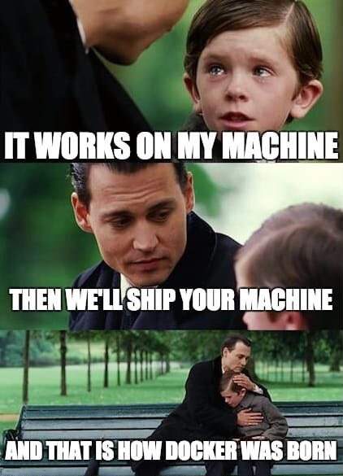

---

---

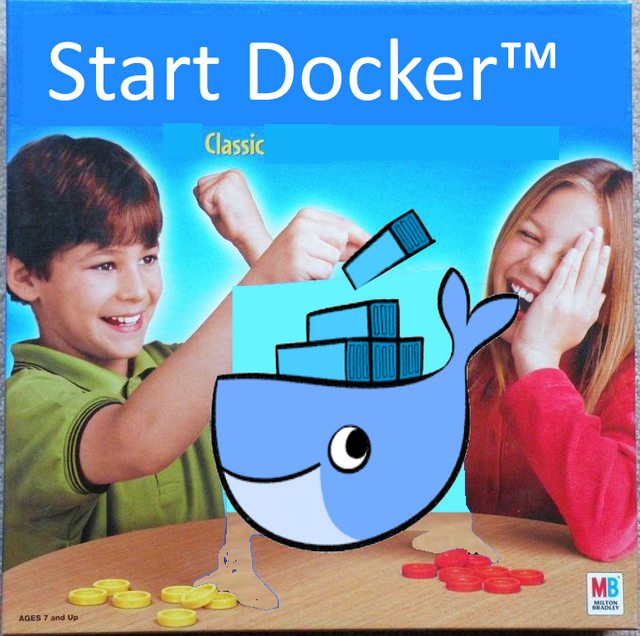

---

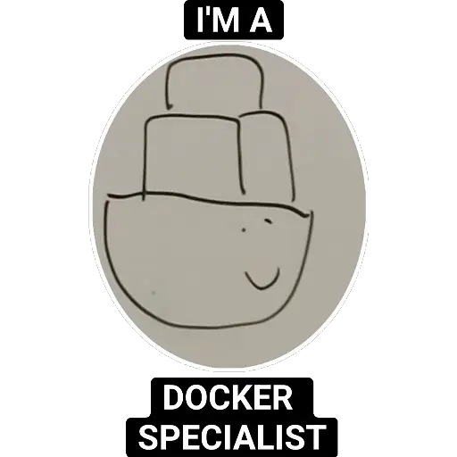

---

## Understanding Containerization

---

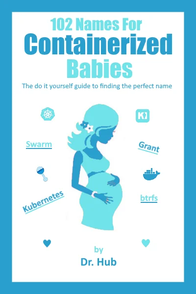

---

## Docker Architecture

---

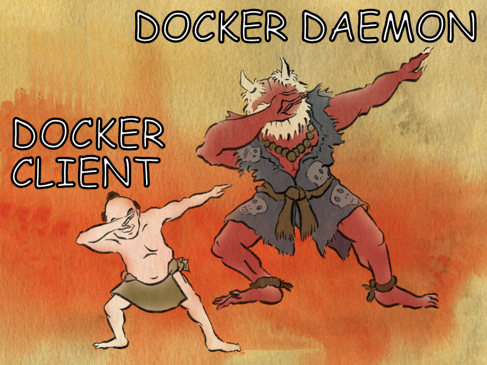

---

## Images, Containers, and Registries

---

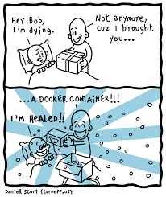

---

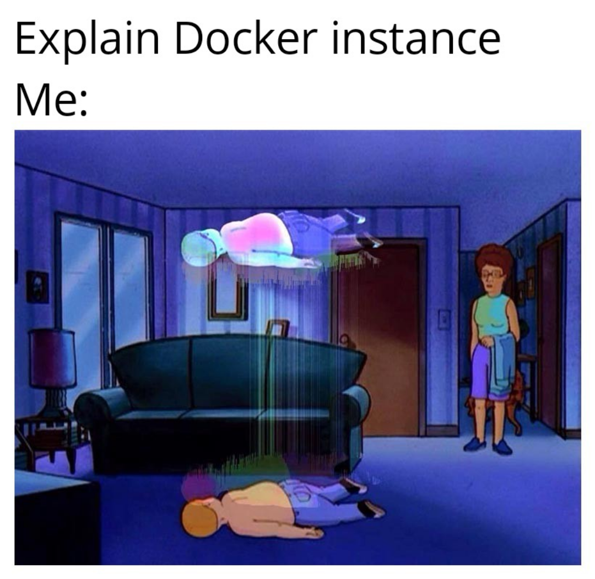

---

## Advantages

---

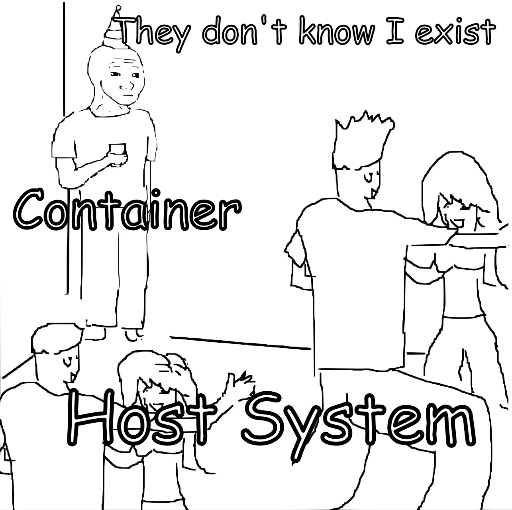

---

---

## Disadvantages

---

---

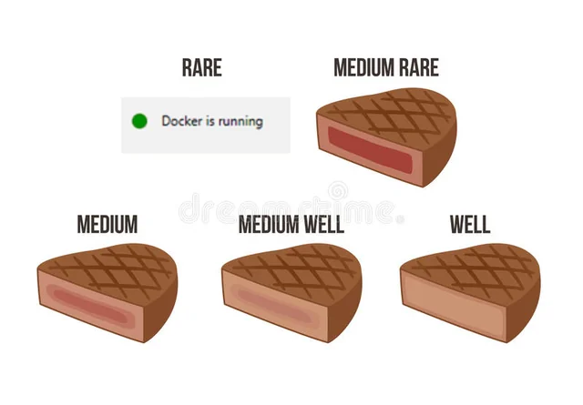

---

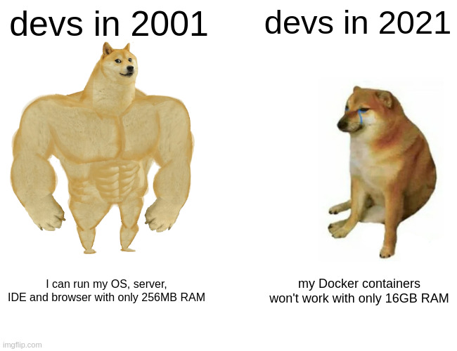

---

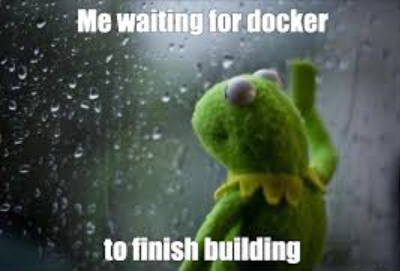

---

## Use Cases

---

---

## Docker vs. Virtual Machines

---

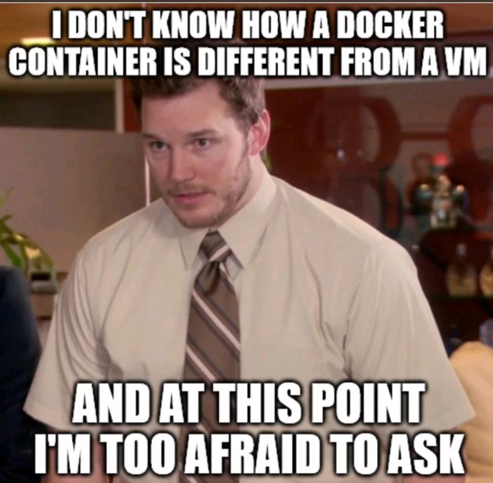

---

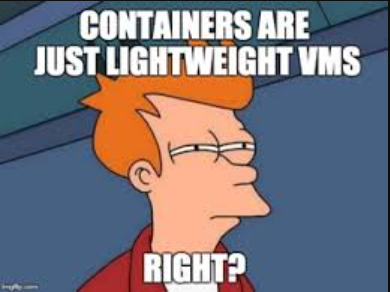

---

---
